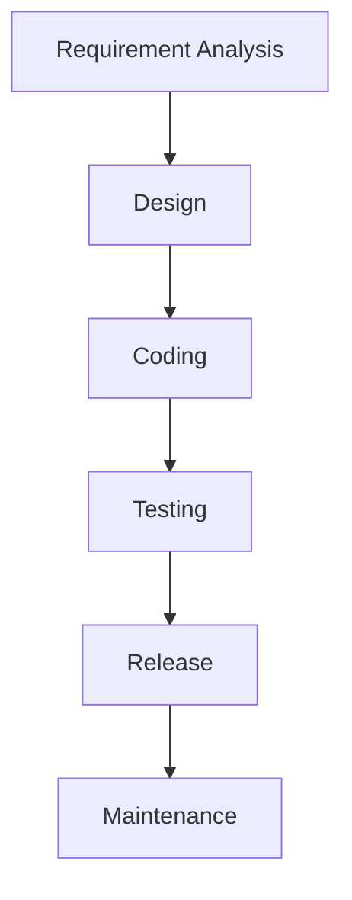
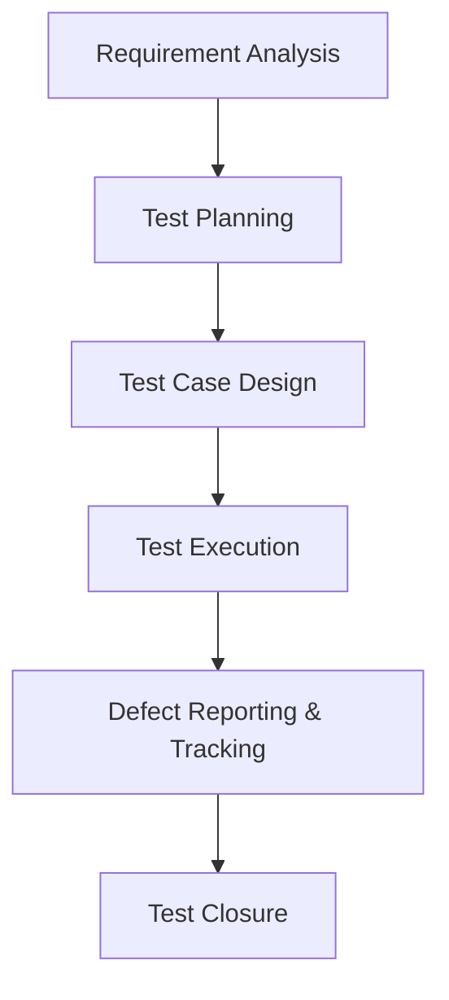
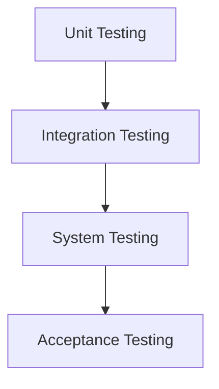
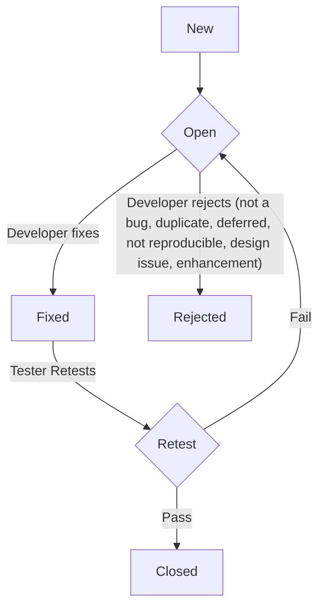

Hello there! As an SDET, you're looking for a concise yet comprehensive manual testing guide in markdown, complete with figures, diagrams, and emojis for a Material for MkDocs setup. Let's dive in!

---

# 📚 Manual Testing: Your Go-To Guide for SDETs

Manual testing is a **crucial part of software development** that involves a person actively using the software to find bugs and issues. It's a hands-on approach ensuring software works as intended and meets user needs.

## 🎯 What is Manual Testing?

Manual testing is a technique where a QA manually tests a software application to **identify bugs** by following predefined test cases. The QA analyzes performance from an end user’s perspective, comparing actual behavior against expected behavior, reporting any differences as a bug.

*   **Example:** If a login button doesn't redirect to the homepage as expected, that's a bug to report.

## 💡 Why Manual Testing is Essential

Despite the rise of automation, manual testing remains vital for several reasons:
*   **Human Intuition & User Experience** 🧑‍🤝‍👩: Humans are creative and can test software in ways automated testing might miss, providing insights into user-friendliness.
*   **Early Defect Detection** 🐛: It helps discover bugs in the early stages of the SDLC, especially for UI/UX.
*   **Flexibility & Adaptability** 🤸: Testers can adjust to changing conditions and requirements, ideal for early prototypes or unplanned changes.
*   **Cost-Effectiveness for Small Projects** 💰: For small, short-term projects, it can be cheaper than setting up automation frameworks.
*   **Feasibility Check for Automation** ✅: Every new application needs manual testing before automation feasibility can be checked.
*   **Ensures Bug-Free & Stable Product** ✨: The main goal is to deliver a stable, bug-free product that conforms to requirements.

## 🌟 Key Characteristics of Manual Testing

Manual testing involves specific attributes that distinguish it:
*   **Human Performance** 🙋: Conducted by human testers using the product like end-users, providing input and observing results.
*   **Investigative/Exploratory Testing** 🔍: Testers explore applications without predefined test cases, aiding in locating unforeseen problems.
*   **Time-Intensive** ⏳: Requires significant time, especially for large systems.
*   **Visual Feedback** 👀: Ensures the user interface aligns visually with user expectations.
*   **Hands-on Understanding** 🙌: Provides deeper insights into real-time behavior and usability.
*   **No Programming Knowledge Required** (for black-box) 🧑‍💻: Testers interact like regular users without complex code.
*   **Prone to Human Error** 🤦‍♀️: Testers might overlook aspects due to fatigue or human error.
*   **Less Reliable / Consistent** 📉: Does not provide testing on all aspects, and results can be subjective.
*   **Limited Coverage** 🤏: Difficult to achieve comprehensive test coverage, especially in complex systems.

## 🏗️ Software Development Life Cycle (SDLC)

SDLC is a **step-by-step process** used by the software industry to design, develop, and test software in a systematic way. It ensures a quality product delivery.

**SDLC Phases** ⚙️:
1.  **Requirement Analysis** 📋: Understanding and documenting customer needs (e.g., BRD, SRS, CRS).
2.  **Design** 🏗️: System architects build the complete framework and architecture (High-Level Design, Low-Level Design).
3.  **Coding/Development** 💻: Development team writes the software code based on design documents.
4.  **Testing** ✅: Testing team evaluates the software for defects and compliance with requirements.
5.  **Release/Deployment** 🚀: Software is deployed to the customer environment.
6.  **Maintenance** 🔧: Ongoing support and updates for the software.



## 📜 SDLC Models

Companies follow various SDLC models based on project size, cost, and requirements. Each model has a different approach to following SDLC phases.

### 💧 Waterfall Model
*   **Definition:** A traditional, old, and linear sequential model where phases are followed step-by-step, like a ladder. One phase must complete before the next begins, and there's no going back to a previous phase.
*   **When to Use:** For short, non-complex projects with clear and static requirements.
*   **Advantages** ✅:
    *   Good product quality due to detailed documentation in every phase.
    *   Less chances of bugs as requirements don't change frequently.
*   **Disadvantages** ❌:
    *   Not suitable for complex or long projects.
    *   Cannot accommodate changing requirements.
    *   Difficult and costly to fix defects found late in the cycle as it requires going back to previous phases.

### 🌀 Spiral Model
*   **Definition:** A **risk-driven model** that combines elements of the Waterfall and Iterative models. It's an incremental development approach focusing on risk analysis in each cycle.
*   **Phases:** Planning, Risk Analysis, Engineering (Design & Development), and Evaluation.
*   **Iterative & Incremental:** Each cycle is an iteration, and new modules are added incrementally. Each cycle releases a new version of the software.
*   **When to Use:** When frequent deliveries are required and requirements may change. Not suitable for smaller projects due to high cost.
*   **Advantages** ✅: Risk handling is a key feature. Testing is done in every cycle.
*   **Disadvantages** ❌: Costly and not suitable for smaller projects.

### 📐 V-Model (Verification & Validation Model)
*   **Definition:** An extension of the Waterfall model where each development phase is associated with a testing phase, executed in a V-shaped manner. It’s also called the **V&V Model**.
*   **Two Sides:**
    *   **Left Side (Verification / SDLC / Quality Assurance):** Focuses on checking documents (BRD, SRS, HLD, LLD) and involves static testing.
    *   **Right Side (Validation / STLC / Quality Control):** Focuses on actual product testing (Unit, Integration, System, Acceptance testing) and involves dynamic testing.
*   **Key Idea:** "Are we building the product right?" (Verification) vs. "Are we building the right product?" (Validation).
*   **Advantages** ✅:
    *   Testing starts from the beginning of the project.
    *   Defects are found at an early stage, reducing fixing cost.
    *   Better understanding of requirements due to early testing involvement.
*   **Disadvantages** ❌:
    *   Not good for complex or object-oriented projects.
    *   High documentation effort.
    *   No working software is produced until late in the life cycle.
    *   High initial investment as all teams (dev, test) are hired early.

```mermaid
graph LR
    subgraph Verification (SDLC / Quality Assurance)
        CRS(Customer Requirement Spec.) --&gt; BRD(Business Requirement Doc.)
        BRD --&gt; SRS(Software Requirement Spec.)
        SRS --&gt; HLD(High Level Design)
        HLD --&gt; LLD(Low Level Design)
        LLD --&gt; Coding(Coding)
    end

    subgraph Validation (STLC / Quality Control)
        Coding --&gt; UnitTest(Unit Test)
        UnitTest --&gt; IntegrationTest(Integration Test)
        IntegrationTest --&gt; SystemTest(System Test)
        SystemTest --&gt; AcceptanceTest(Acceptance Test)
        AcceptanceTest --&gt; CRS
    end

    subgraph Verification Links
        CRS -- QA: Acceptance Test Plan & Cases --> AcceptanceTest
        SRS -- QA: System Test Plan & Cases --> SystemTest
        HLD -- QA: Integration Test Plan & Cases --> IntegrationTest
        LLD -- QA: Functional Test Plan & Cases --> FunctionalTest
        Coding -- Dev: Unit Test / White Box --> UnitTest
    end
```
*Note: Functional Test is part of System Testing.*

### 🔄 Iterative Model
*   **Definition:** Software is developed through repeated cycles (iterations). Each iteration delivers a working piece of software (build) based on prioritized requirements.
*   **Process:** Pick one requirement (e.g., X), follow complete SDLC phases (requirement analysis, design, coding, testing, release), deliver first build, get feedback, then work on next requirement (Y).
*   **Iterative + Incremental:** It's iterative because it repeats cycles, and incremental because modules are added over time.
*   **Advantages** ✅:
    *   Debugging is easier as work is divided into modules.
    *   Easily adaptable to changing requirements.
    *   Risks are identified and resolved during each iteration.
*   **Disadvantages** ❌:
    *   Not suitable for smaller projects due to increased cost.
    *   Design can change repeatedly due to imperfect requirements.
    *   Project completion date may not be confirmed due to changing requirements.

### 🏃 Agile Model
*   **Definition:** Focuses on **continuous delivery** of software and handling **frequent requirement changes**. It's an **iterative and incremental** approach.
*   **Sprints:** Project requirements are divided into modules or "Sprints," typically 2-3 weeks long. Each Sprint involves planning, design, development, testing, release, and feedback.
*   **Key Terms** 🔑:
    *   **Sprint:** A time-boxed iteration (e.g., two weeks) for delivering a working module.
    *   **Scrum:** A framework based on Agile principles.
    *   **Scrum Master:** Facilitates the Scrum process, usually for a particular project/scrum.
    *   **User Story:** Customer requirements split into features.
    *   **Product Backlog:** A list of prioritized user stories to be developed.
    *   **Story Point:** Defines the complexity of a user story from Dev and QA perspective.
*   **Meetings** 🤝:
    *   **Daily Standup/Scrum:** Short daily meeting to discuss progress, what was done, what will be done, and any blockers.
    *   **Sprint Review:** End-of-sprint meeting to discuss progress.
    *   **Sprint Retrospective:** After sprint completion, discusses what went well, what didn't, and improvements for the next sprint.
    *   **Defect Triage Meeting:** Discusses progress on defects, open status, and prioritization.
*   **Advantages** ✅: Better adaptability to change, continuous delivery.
*   **Disadvantages** ❌: Difficulty in estimating complex projects, risk of everlasting project if requirements keep changing.

### 🤝 Hybrid Model
*   **Definition:** A **combination of two or more primary SDLC models**, modified as per business requirements. Used when features of multiple models are desired in a single model.
*   **When to Use:**
    *   When requirements are unclear (often combined with Prototype model).
    *   When an organization transitions to an Agile model.
*   **Examples:** Spiral + Prototype, V-model + Prototype.
*   **Advantages** ✅: Highly flexible, less customer rejection due to prototypes, easy to implement. Useful for small to medium-sized projects.
*   **Disadvantages** ❌: May not allow usual standards, difficult to handle for complex projects.

### 🧪 Prototype Model
*   **Definition:** Based on customer requirements, an **early version or dummy model (prototype)** of the product is created for user feedback and refinement until an acceptable outcome is achieved.
*   **When to Use:** When customer requirements are unclear or if the client is new to the market.
*   **Types of Prototypes** (for knowledge):
    *   **Rapid Throwaway:** Built quickly, gets feedback, then discarded.
    *   **Evolutionary:** Continuously refined and evolved into the final product.
    *   **Incremental:** Builds multiple prototypes incrementally, combining them for the final product.
    *   **Extreme:** Used for UI development, starts with static pages, then incrementally adds functionality.
*   **Advantages** ✅: Reduces project risk, helps clarify ambiguous requirements, enables early user feedback.
*   **Disadvantages** ❌: Costly and time-consuming, excessive documentation due to continuous changes, potential for too much variation in requirements.

### 💡 Derived Model (Customized Model)
*   **Definition:** Takes a **basic model (e.g., Waterfall)** and customizes it to specific customer requirements.
*   **Examples:** Spiral Model and V-Model are derived from the Waterfall Model.
*   **Key Feature:** Customization of a base model to add specific functionalities or address particular challenges (e.g., Risk analysis in Spiral model).

## 🔄 Software Testing Life Cycle (STLC)

STLC is a **step-by-step standard process** to test any software or application. It's a part of the SDLC.

**STLC Phases** ⚙️:
1.  **Requirement Analysis** 📝: Understand requirements (functional, non-functional), identify testable items, and create a Requirement Traceability Matrix (RTM).
2.  **Test Planning** 📅: Test lead defines project scope, identifies resources, schedules, deliverables, approach, and effort estimation; prepares Test Plan and Test Strategy documents.
3.  **Test Case Design** 🖊️: Testers design (author) detailed test cases, get them reviewed, and update based on feedback. Create test data.
4.  **Test Execution** ▶️: Testers execute test cases on the build, compare actual vs. expected results, and log defects for failed cases. Sanity testing is often the first step here.
5.  **Defect Reporting & Tracking** 🐛: Report defects to developers, map defects to test cases in RTM, retest fixes, and track status to closure. This involves the Defect Life Cycle.
6.  **Test Closure** 🏁: Final stage where testing objectives are reviewed, defects confirmed fixed, and test summary reports are generated.



## 📝 Test Documentation

Effective testing relies on well-structured documentation.

### 📋 Test Plan
*   **Definition:** A **detailed document** that outlines the **scope, objective, approach, schedule, estimations, deadlines, and resources** for testing a project.
*   **Prepared by:** Test Lead or Senior Test Engineer.
*   **Key Sections** 📚:
    *   **Overview/Introduction:** Purpose and project description.
    *   **Scope (Inclusions & Exclusions):** What to test, what not to test.
    *   **Test Strategy:** Approach to testing (e.g., functional, non-functional, automation vs. manual).
    *   **Pass/Fail Criteria:** Conditions for suspending or passing a build.
    *   **Entry/Exit Criteria:** Conditions to start and stop testing at various levels (Unit, Integration, System, Acceptance).
    *   **Roles & Responsibilities:** Team members and their roles.
    *   **Test Schedule:** Dates for testing activities.
    *   **Test Deliverables:** Documents to be submitted (e.g., test cases, defect reports, test execution results).
    *   **Test Environment:** Hardware/software configurations.
    *   **Risk & Mitigation Plan:** Challenges and their solutions.
    *   **Approval:** Sign-off from Project Manager and Customer.

### 🗺️ Test Strategy
*   **Definition:** An **outline describing the complete approach of testing**. It focuses on **how to test** the application (techniques, design methods).
*   **Level:** Prepared at the **organization level**, applicable to multiple projects.
*   **Key Aspects:** Documentation formats, test processes, team reporting structure, client communication strategy.
*   **Difference from Test Plan:**
    *   **Test Strategy:** How to test (approach, techniques), organization-level, rarely changes.
    *   **Test Plan:** What, when, and who will test; project-level, can change.

### 📝 Test Cases
*   **Definition:** A **set of actions executed to verify a particular feature or functionality** of an application. It focuses on **what to test** and **how to test**.
*   **Importance** 💡:
    *   **Better Coverage** ✅: Ensures maximum coverage of scenarios and functionalities.
    *   **Improved Quality** ✨: Helps find more and better defects, improving application quality.
    *   **Tracking** 📊: Enables proper tracking of test scenarios, test cases, and defects via traceability matrix.
*   **Good Test Cases** 👍:
    *   **Simple & Transparent:** Easy to understand with clear steps.
    *   **Traceable:** Linked to requirement ID in RTM.
    *   **Brief & Short:** Only necessary and valid steps.
    *   **Positive & Negative:** Implement both positive (valid data) and negative (invalid data) scenarios.
    *   **Maintainable:** Easy to maintain and update.
    *   **User-Centric:** Cover usability aspects from an end-user perspective.
    *   **Security & Performance:** Consider security (user permissions, session management) and performance (multi-user operations) aspects.
*   **Format** 📄 (Common sections in a test case document):
    *   **Project Name, Module Name, Reference Document**.
    *   **Author, Date of Creation/Review**.
    *   **Test Case ID** (Unique, meaningful, e.g., `TC_FB_Login_001`).
    *   **Scenario, Test Case Summary/Description**.
    *   **Precondition:** Conditions to be met before execution.
    *   **Priority:** Importance of the test case (P0, P1, P2, P3).
    *   **Test Steps:** Detailed execution steps.
    *   **Test Data:** Input data used.
    *   **Expected Result:** Anticipated output.
    *   **Post Condition:** State after successful execution.
    *   **Actual Result:** Observed output.
    *   **Status:** Pass/Fail based on comparison of actual vs. expected.
    *   **Comments:** Any remarks or execution notes.
*   **Review Process** 🧐: After authoring, test cases undergo self-review, peer review, and sometimes supervisory review (by Test Lead/Manager). Reviews ensure completeness, correctness, proper flow, and maximum coverage.

### 📚 Test Scenarios
*   **Definition:** Describes the **end-to-end functionality to be tested** in an application. It's a **high-level document** with one-liner information.
*   **Focus:** Primarily on **what to test**.
*   **Derivation:** Derived from Business Requirement Documents (BRS) or Functional Requirement Specifications (FRS).
*   **Relationship with Test Cases:** A test scenario can have multiple test cases.

### 🗺️ Use Cases
*   **Definition:** Describes the **behavior of a system to do a particular task and accomplish a goal** from an end-user perspective. They help understand requirements more clearly, often represented with diagrams.
*   **Components:** Typically include an **Actor** (user), **System**, and the **Use Case** itself.
*   **Relationship with Test Scenarios/Cases:** Use cases are inputs to derive test scenarios, which in turn are used to write test cases.

### 📊 Traceability Matrix (RTM)
*   **Definition:** A document that **maps requirements to test cases** to ensure complete coverage and track defects. It's also known as **Requirement Traceability Matrix (RTM)** or **Cross-Reference Matrix (CRM)**.
*   **Purpose** 🎯:
    *   Ensures each requirement has at least one test case, guaranteeing **complete test coverage**.
    *   Helps **find the root cause of defects** by tracing back from defect to test case, scenario, and requirement.
    *   Identifies any **gaps or missing requirements**.
*   **Mapping:** Requirement ID ➡️ Scenario ➡️ Test Case ID ➡️ Test Result ➡️ Defect ID ➡️ Defect Status.
*   **Types** 📜:
    *   **Forward Traceability Matrix:** Maps requirements to test cases (done before execution).
    *   **Backward/Reverse Traceability Matrix:** Maps test cases back to requirements (done after execution).
    *   **Bidirectional Traceability:** Combines both forward and backward tracing.

### 🐛 Defect Report
*   **Definition:** A document or entry in a bug tracking tool that provides **concise details about identified defects**, including steps to reproduce, expected results, and actual application behavior.
*   **Reasons for Defects** 🤷‍♀️:
    *   Missing requirements.
    *   Wrong implementation of requirements.
    *   Misunderstanding of requirements by developers.
*   **Key Fields in a Defect Report** 📄:
    *   **Defect ID:** Unique identifier (auto-generated by tools).
    *   **Summary/Description:** Brief explanation of the defect.
    *   **Detected By:** Tester who found the defect.
    *   **Detected Date:** Date the defect was found.
    *   **Assigned To:** Developer responsible for fixing.
    *   **Severity:** Impact/seriousness of the defect (Blocker, Critical, Major, Minor).
    *   **Priority:** Importance/urgency of fixing (High, Medium, Low).
    *   **Status:** Current state of the defect (New, Open, Fixed, Retest, Closed, Reopened, Rejected, Duplicate, Deferred, Not a Bug).
    *   **Build Version:** Software version where the defect was found.
    *   **Module:** Specific module affected.
    *   **Environment:** Environment where defect was found (Test, Dev, UAT).
    *   **Defect Type:** Functional, Non-functional, Performance, etc..
    *   **Reproducible:** Yes/No, whether the defect can be consistently reproduced.
    *   **Reproducible Steps:** Step-by-step instructions to trigger the defect.
    *   **Expected/Actual Result:** What should happen vs. what happened.
    *   **Comments:** Any additional remarks.

## 🧪 Types of Testing

Software testing can be categorized in many ways, including functional vs. non-functional, and different levels.

### ⚙️ Functional Testing
*   **Definition:** Checks whether the features of the application work according to the specified requirements. It verifies that the system does what it's supposed to do.
*   **Focus:** Functionality and behavior of the application, not internal structure.
*   **Types** (Examples):
    *   **User Interface (UI) Testing:** Verifies UI elements (buttons, text boxes, images, links, etc.) are present, displayed properly, and function as expected.
    *   **Object Properties Testing:** Verifies properties of elements like enabled/disabled state.
    *   **Error Guessing Testing:** Involves performing invalid operations to validate if proper, meaningful error messages are displayed. (Experience-based testing).
    *   **Input Domain Testing:** Verifies data acceptance by the system. Techniques include Boundary Value Analysis and Equivalence Class Partitioning.
    *   **Database Testing:** Verifies data integrity, stored procedures, triggers, and data manipulation operations (insert, update, delete, select) at the database level.
    *   **Calculation Testing:** Verifies calculations in the application are correct.
    *   **Links & URL Testing:** Verifies links redirect to target pages and broken links are handled.

### 📈 Non-Functional Testing
*   **Definition:** Checks **non-functional aspects** like performance, usability, security, reliability, etc., of a software application. It focuses on *how* the system performs.
*   **Types** (Examples):
    *   **Usability Testing:** Verifies if the application is easy to use, operate, and understand.
    *   **Performance Testing:** Calculates application response time under various loads (e.g., Load, Stress, Volume, Spike testing). Tools like LoadRunner, JMeter.
    *   **Security Testing:** Verifies if the application can be accessed only by authorized users and is protected against threats.
    *   **Compatibility Testing:** Checks application behavior across different environments (OS, browsers, devices).
    *   **Configuration Testing:** Verifies application behavior on different software and hardware configurations.
    *   **Recovery Testing:** Tests system's ability to recover from crashes or hardware failures.
    *   **Installation Testing:** Verifies the installation and uninstallation process of the software.
    *   **Compliance Testing:** Ensures application complies with market standards and company policies.
    *   **Documentation Testing:** Verifies project-related documents.
    *   **Interoperability Testing:** Verifies end-to-end workflow.
    *   **Sanitation/Garbage Testing:** Checks if application provides extra unwanted features.

### 🪜 Levels of Software Testing

There are four main levels of testing, performed in a specific hierarchy to ensure comprehensive quality.



1.  **Unit Testing** (Component/Module Testing) 🧩
    *   **Definition:** Tests individual units or components of source code (smallest testable part) in isolation.
    *   **Who Performs:** Primarily **developers** or white-box testers.
    *   **Technique:** **White Box Testing**.
    *   **Goal:** Find defects as early as possible.
    *   **Techniques** (Examples):
        *   **Structural Techniques:** Verify internal structure of program (Statement, Condition, Branch, Path testing).
        *   **Functional Testing:** Some black-box testing at unit level.
        *   **Error-Based Testing:** (e.g., Error Guessing, Mutation Testing).

2.  **Integration Testing** (Module Interface Testing) 🔗
    *   **Definition:** Tests the interfaces and data flow between two or more integrated modules.
    *   **Who Performs:** Testers, sometimes with developer help.
    *   **Approaches**:
        *   **Big Bang Approach:** All modules integrated and tested at once (less effective for large projects).
        *   **Incremental Approach:** Modules integrated one by one.
            *   **Top-Down:** Main module to sub-module. Uses **Stubs** (substitute for sub-module).
            *   **Bottom-Up:** Sub-module to main module. Uses **Drivers** (substitute for main module).
            *   **Mixed/Sandwich:** Combination of top-down and bottom-up.

3.  **System Testing** (End-to-End System Testing) 🖥️
    *   **Definition:** Tests the **complete integrated system** to evaluate compliance with specified requirements. It's the first level where the entire system is tested end-to-end.
    *   **Who Performs:** Primarily **testers**.
    *   **Technique:** **Black Box Testing**.
    *   **Focus:** Both **functional and non-functional aspects** of the application.
    *   **Advantage:** Helps find maximum bugs before acceptance testing.

4.  **Acceptance Testing** (User Acceptance Testing - UAT) 🤝
    *   **Definition:** The **highest level of testing** performed to ensure the software meets user expectations and real-world conditions. It validates the software against customer requirements.
    *   **Who Performs:** **Real users** (customers/end-users) at their location, sometimes with testers.
    *   **Goal:** Gain customer validation and reduce product failure risk post-launch.
    *   **Levels**:
        *   **Alpha Testing:** Conducted by internal teams at the development site, often a "pre-UAT". Helps uncover serious bugs early.
        *   **Beta Testing:** Conducted by a limited number of real users at their own locations in a real environment. Provides direct feedback from customers.

### 🧩 Other Testing Types

Beyond the levels, specific types of testing address particular concerns.

*   **Smoke Testing** 💨 (Build Verification/Acceptance Testing)
    *   **Definition:** A **preliminary check** on an unstable build to verify if **critical functionalities** are stable and working fine. It's a subset of acceptance testing.
    *   **Goal:** To decide if the build is stable enough for further testing (build acceptance or rejection).
    *   **Characteristics:** Usually documented and scripted. Conducted quickly (15-30 minutes).
    *   **Who Performs:** Both developers and testers.

*   **Sanity Testing** 🧠 (Surface Level Testing)
    *   **Definition:** A quick, random, and **unscripted** test performed after bug fixes or new features to ensure they work as expected and don't break related functionalities. It's a subset of regression testing.
    *   **Goal:** To determine if new module additions or bug fixes are stable enough to pass to the next level of testing.
    *   **Characteristics:** Not documented or scripted, quick and speedy.
    *   **Who Performs:** Only testers.

*   **Regression Testing** ♻️
    *   **Definition:** Performed after any code changes, updates, or bug fixes to **verify that new code does not negatively impact existing, unchanged features**.
    *   **Goal:** Ensure the stability of the software after updates.
    *   **Types:** Unit Regression, Partial/Selective Regression, Full Regression.

*   **Retesting** 🔁
    *   **Definition:** Testing a specific bug **after it has been fixed** to ensure the bug is resolved and works as expected.
    *   **Goal:** Verify defect fixes.
    *   **Characteristics:** Planned testing with proper verification steps. High priority.

| Parameter           | Smoke Testing                                                                     | Sanity Testing                                                                |
| :------------------ | :-------------------------------------------------------------------------------- | :---------------------------------------------------------------------------- |
| **Purpose**         | Verify stability of critical functionalities in an unstable build.          | Verify rationality/quality of specific changes and related functionalities. |
| **Scope**           | Wide and high-level (critical functionalities of entire system).          | Shallow and focused (particular component or bug fix and related areas). |
| **Build State**     | Performed on an unstable build.                                             | Performed on a stable build (after bug fix or new feature).           |
| **Scripted?**       | Usually documented and scripted (subset of acceptance tests).         | Not documented or scripted (random, quick check).                |
| **Who Performs?**   | Both developers and testers.                                                | Only testers.                                                           |
| **When Done?**      | At the beginning of testing cycle for new builds.                           | After bug fixes or new feature implementations.                       |

| Parameter           | Retesting                                                                 | Regression Testing                                                                    |
| :------------------ | :------------------------------------------------------------------------ | :------------------------------------------------------------------------------------ |
| **Purpose**         | To ensure a specific bug is fixed and working as expected. | To ensure changes haven't negatively impacted unchanged parts of the product. |
| **Scope**           | Focused on the specific failed test case(s).                     | Wide, covering related and sometimes all existing functionalities.           |
| **Test Cases**      | Re-executes failed test cases from previous execution.             | Re-runs a subset of existing test cases.                                   |
| **Automation**      | Cannot be automated (specific bug validation).                       | Can often be automated (repetitive tasks).                             |
| **Priority**        | High priority (bug must be verified).                               | Can be done in parallel with retesting.                                         |
| **New Build Req.**  | Requires a new build with the fix.                                 | Can be done on the same build or new builds.                                |

## 🐛 Defect Management

Managing defects effectively is crucial for software quality.

### 🔄 Defect Life Cycle (Bug Life Cycle)
This is the **journey of a defect** from its discovery to closure.



**Defect Statuses** 📊:
*   **New:** Defect is reported for the first time.
*   **Open:** Developer is currently working on the defect.
*   **Fixed:** Code changes are completed, and the defect is resolved by the developer.
*   **Retest:** Developer assigns the fixed defect back to testing team for re-verification.
*   **Closed:** Defect is verified by the tester and confirmed as fixed.
*   **Reopened:** Defect is found again during retesting (fix was unsuccessful).
*   **Rejected:** Developer deems the defect invalid (e.g., Not a Bug, Duplicate, Deferred, Not Reproducible, Design Issue, Enhancement).
    *   **Duplicate:** Matches a previously reported defect.
    *   **Deferred:** Not important for current cycle, planned for next.
    *   **Not a Bug:** Not an actual defect, works as intended.
    *   **Not Reproducible:** Developer cannot reproduce the defect in their environment.
    *   **Enhancement:** Not a defect, but a new feature request.

### ⚖️ Defect Priority & Severity
These two attributes classify defects for effective management and prioritization.

*   **Severity** (Seriousness) 📉
    *   **Definition:** Defines **how impactful or serious a bug is to the system** and its impact on business workflow.
    *   **Who Assigns:** Tester.
    *   **Types** (from highest to lowest impact):
        *   **Blocker (Show Stopper):** Completely blocks testing or prevents the main functionality from working. E.g., Unable to login, 500 internal server error.
        *   **Critical:** Major functionality is severely impacted or critical data loss occurs. E.g., Application crashes for frequently used functionality.
        *   **Major:** Functionality is not working as expected, but a workaround exists, or there is no critical impact. E.g., Unable to delete all emails at once.
        *   **Minor:** Cosmetic issues, UI misalignments, spelling mistakes not impacting core functionality. E.g., Spelling mistake on a rarely visited page.

*   **Priority** (Importance) ⬆️
    *   **Definition:** Indicates **how soon the defect should be fixed** (importance).
    *   **Who Assigns:** Tester initially, may be changed by developer/BA.
    *   **Types** (from highest to lowest urgency):
        *   **High (P0/P1):** Must be fixed immediately. E.g., Blocker or Critical severity issues, or high business impact.
        *   **Medium (P2):** Should be fixed in the current release, but not immediately critical.
        *   **Low (P3):** Can be fixed in future releases or if time permits.

| Severity / Priority | High Priority                                                                | Low Priority                                                                  |
| :------------------ | :--------------------------------------------------------------------------- | :---------------------------------------------------------------------------- |
| **High Severity**   | Unable to Login, 500 Internal Server Error (Blocker issue). | "About Us" link goes to a blank page (functionality broken but not critical to immediate release). |
| **Low Severity**    | Company logo incorrect (High business importance, low functional impact). | Spelling mistake on a page not frequently navigated.           |

### 🌊 Defect Leakage
*   **Definition:** When defects **escape from one level of testing to another**, particularly from QA testing to UAT or production.
*   **Calculation:** `(Number of Defects found by end-user / (Total Defects Raised by QA - Invalid Defects)) * 100`. (e.g., 5.5% in source example).
*   **Reasons for Leakage** 😞:
    *   Absence of proper review process.
    *   Poorly designed test cases (e.g., due to misunderstanding requirements).
    *   Incorrect deployment (in UAT or Production).
    *   Incorrect/insufficient test data.
*   **Prevention** 🛡️:
    *   Proper review process (test cases, testing process).
    *   Design proper test cases (good coverage).
    *   Focus on error-prone modules.
    *   Proper regression testing.

### 💥 Defect Clustering
*   **Definition:** When a **small number of modules contain most of the bugs** detected, or defects are concentrated across a few functionalities. It's also known as the **80/20 Rule** (Pareto Principle).
*   **80/20 Rule:** 80% of defects are found in 20% of the modules.
*   **Reason:** High complexity of certain modules, or mistakes by developers in logic/code.
*   **Tester's Action:** Concentrate more on error-prone modules, write more test cases, but don't ignore other modules.

### 🕰️ Defect Age
*   **Definition:** The **time difference from the defect found date to the defect closed date**.
*   **Calculation:** Can be in days/hours or in phases (e.g., found in Requirement Analysis, closed in Testing = 2 phases).

### 🎭 Defect Masking
*   **Definition:** A defect that **hides other defects** in the application. It's a hidden defect that hasn't caused a failure because another defect prevented that part of the code from being executed.
*   **Impact:** Uncovered only when the defect hiding it is resolved.
*   **Example:** A defect on an "Add Employee" page prevents navigation to an "Add Task" page, thus masking any defects on the "Add Task" page.

### 🚨 Defect Triage
*   **Definition:** The process to **prioritize defects** based on their severity, priority, risk involvement, and frequency of occurrence. It means to "decide the order" or "sort it out".
*   **Purpose:** To evaluate defects and decide which ones are possible to fix, especially when time is limited.
*   **Meeting:** Conducted by Project Manager, Developers, Testers, and Business Users.
*   **Outcome:** Prioritized list of defects, re-assigned priorities/severities if needed, and a decision on deferring non-critical defects.

## 🛠️ Testing Techniques & Methods

Testers use various techniques and methods to approach testing.

### 📦 Black Box Testing
*   **Definition:** Tests the **functionality of a system without any knowledge of its internal workings or code**.
*   **Focus:** User's perspective, inputs, and expected outputs.
*   **Examples:** Functional testing types like UI, Database (from UI perspective).

### ⚪ White Box Testing
*   **Definition:** Tests the **internal structure, logic, and code** of a software system.
*   **Focus:** Developer's perspective, internal logic, performance, and efficiency.
*   **Who Performs:** Developers or white-box testers.
*   **Examples:** Unit testing, sometimes integration testing.

### ⚫ Grey Box Testing
*   **Definition:** Combines approaches of both black box and white box testing.
*   **Focus:** Partial knowledge of internal details, testing some internal workings but not all.
*   **Used In:** Often in system integration testing.

### 🧪 Static Testing
*   **Definition:** Involves **testing project-related documents** (e.g., BRD, SRS, design documents, code) **without executing the actual software**. It ensures correctness and completeness of documentation.
*   **Techniques**:
    *   **Reviews:** Reading documents to ensure correctness and completeness. (Requirements review, design reviews, code reviews, test plan/test case reviews).
    *   **Walkthroughs:** Informal reviews where the author guides peers through the document/code to explain and gather feedback.
    *   **Inspections:** More formal, pre-planned reviews with a structured process involving a moderator, reader (author), and writer (notes issues).

### ⚡ Dynamic Testing
*   **Definition:** Involves **testing the actual software** by providing different inputs and observing outputs, typically performed after coding is done.
*   **Techniques:** Unit testing, Integration testing, System testing, Acceptance testing.

### 📐 Test Design Techniques
These techniques help in designing effective test cases, ensuring better coverage, and finding maximum defects.

1.  **Boundary Value Analysis (BVA)** 📏
    *   **Definition:** Focuses on testing values **at the boundaries** of valid and invalid input ranges.
    *   **Concept:** Defects are often found at the edges of valid input ranges.
    *   **Example:** For a field accepting values 18-35, test 17, **18**, **19**, **34**, **35**, 36.

2.  **Equivalence Class Partitioning (ECP)** 🗂️
    *   **Definition:** Divides a set of test conditions into **groups or partitions** that can be considered the same. From each partition, one value is picked for testing.
    *   **Concept:** If one value in a partition works, others in that partition are likely to work too.
    *   **Example:** For a field accepting 1-500, partitions could be: invalid (<1), valid (1-500), invalid (>500).

3.  **Decision Table Testing** 🔀
    *   **Definition:** Used to test system behavior for **different input combinations**. It tabulates input conditions and corresponding system actions/outputs.
    *   **When to Use:** When a system has **complex business rules**.
    *   **Example:** Login screen with username, password, and submit. Table shows rules for correct/incorrect username/password combinations leading to homepage or error.

4.  **State Transition Testing** ↔️
    *   **Definition:** Analyzes application behavior based on **changes to input conditions or system states**. Tests designed to execute valid and invalid state transitions.
    *   **When to Use:** For applications with **sequence rules** or finite sets of input values.
    *   **Example:** ATM card entry: wrong password attempts leading to account block.

5.  **Error Guessing Testing** ❓
    *   **Definition:** A type of **experience-based testing** where testers use their prior experience and intuition to guess problematic areas and potential errors.
    *   **Method:** Performing invalid operations and validating the displayed error messages.
    *   **Example:** Uploading a file exceeding maximum limit, or with an invalid format.

## 👻 Common Myths & Challenges in Manual Testing

Despite its importance, manual testing faces misconceptions and inherent difficulties.

### 👻 Common Myths
*   **Testing is easy:** It requires deep understanding and analytical skills.
*   **Anyone can do testing:** Requires passion and a mindset to "break" systems.
*   **Manual testing is obsolete:** It's the backbone; automation comes after product stability.
*   **Manual testers have low pay:** Experienced manual testers are valued and well-compensated in established organizations.
*   **Testers have weak coding skills:** Testing often involves coding (SQL, scripting for automation, data validation).

### 🤯 Challenges with Manual Testing
*   **Repetitive Tasks:** Especially in regression testing, leading to oversight and lack of engagement.
*   **Test Data Management:** Ensuring accuracy, consistency, and relevance, which is time-consuming and error-prone.
*   **Test Environment Setup:** Mimicking production environments is complex and can lead to false results.
*   **Test Case Documentation:** Creating and maintaining comprehensive, understandable, and up-to-date test cases.
*   **Time Constraints:** Balancing deadlines with thorough test coverage often impacts software quality.
*   **Communication & Collaboration:** Miscommunication with development and other teams can complicate defect resolution.
*   **Adaptation to Frequent Changes:** Rapid changes in Agile environments require constant modification of test cases and plans.
*   **Test Data Privacy & Security:** Protecting sensitive data during testing.
*   **Browser & Device Fragmentation:** Testing across numerous devices, OS, and browsers escalates workload.
*   **Test Reporting & Documentation:** Generating and maintaining detailed reports is time-consuming.

## 🏆 Manual Testing Best Practices

To ensure high-quality software, follow these best practices for manual testing:
*   **Thoroughly Understand Requirements** 📋: Study documentation (SRS, FRD) to align testing with intended functionality.
*   **Define Clear Scope & Objectives** 🎯: Outline what to test, specific goals, and approach.
*   **Integrate Risk Analysis** ⚠️: Prioritize testing efforts based on potential defect impact.
*   **Incremental Testing Approach** 📈: Break down testing into components for early defect detection.
*   **Write Effective Test Cases** 📝: Simple, clear, traceable, reusable, covering positive/negative scenarios.
*   **Utilize Exploratory & Ad Hoc Testing** 🔍: Identify unexpected defects and ensure thorough coverage.
*   **Foster Effective Communication** 🗣️: Collaborate closely with development team and stakeholders.
*   **Perform UI Testing** 🎨: Identify layout, design, responsiveness, and usability issues.
*   **Continuous Learning** 🧑‍🎓: Stay informed about product updates and testing methodologies.

## 🛠️ Tools Used for Manual Testing

Various tools support different aspects of manual testing:
*   **Test Management Tools** 📂:
    *   **TestLink:** Web-based system for quality assurance, supports cross-browser testing.
    *   **Jira:** Issue and project tracking, compatible with Agile, manages bugs, tasks, and team collaboration.
    *   **Zephyr:** Jira plugin for test case management and tracking.
    *   **qTest:** Test management platform for collaboration and monitoring test cycles.
    *   **BrowserStack Live / App Live:** Cloud platforms for manual website/app testing on real devices/browsers.
    *   **LambdaTest:** AI-native cloud platform for manual web and mobile app testing on various browsers, devices, and OS combinations.
    *   **TestRail:** Test case management tool.
*   **Bug Tracking Tools** 🐛:
    *   **Bugzilla:** Web-based bug-tracking tool.
    *   **ClearQuest, DevTrack, Bugzilla:** Purely bug tracking tools.
*   **Performance Testing Tools** 🚀:
    *   **LoadRunner:** Simulates real-world user behavior and load.
    *   **Apache JMeter:** Open-source load testing tool.
*   **Mobile UI Testing Tools** 📱:
    *   **Perfecto:** Specifically for mobile UI testing, provides real device screen resolutions.

---